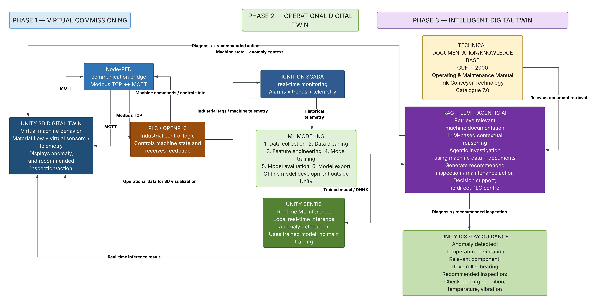

# Industrial Digital Twin — mk GUF-P 2000 BC

An industrial digital twin project built around the **mk GUF-P 2000 BC — Indirect Centre Drive** conveyor.

The project combines virtual commissioning, machine condition monitoring and anomaly detection, and AI-assisted maintenance decision support.

## Project Goals

The project is developed in three connected phases:

### Phase 1 — Virtual Commissioning

Build a functional virtual representation of the GUF-P 2000 BC conveyor in Unity and establish closed-loop communication with a PLC.

**Goal:** Validate PLC control, machine behaviour, material flow, virtual sensors, and communication before introducing condition monitoring.

### Phase 2 — Condition Monitoring & Anomaly Detection

Generate and collect machine operating and condition data and use machine-learning models to identify abnormal behaviour.

The initial monitoring scope focuses on the **drive roller bearing**, using:

- Bearing vibration
- Bearing temperature
- Motor current
- Conveyor speed
- Load
- Machine state
- Alarm/fault state
- Box count as machine/material-flow context

The ML system is intended to identify anomalous operating patterns rather than claim a confirmed component failure.

### Phase 3 — RAG + LLM + Agentic AI

Combine detected machine anomalies with manufacturer technical documentation to provide contextual maintenance guidance.

**Goal:** Retrieve relevant technical information, reason over machine context and documentation, and provide inspection/maintenance recommendations through the Unity interface.

The system is intended as **maintenance decision support**, not direct AI control of the PLC.

---

## Overall System Architecture



---

## Technology Stack

| Technology | Status | Purpose |
|---|---|---|
| **Unity 6.3 LTS** | Implemented | 3D digital twin and virtual machine simulation |
| **C#** | Implemented | Machine behaviour, sensors, physics, telemetry and MQTT integration |
| **OpenPLC v4.2.4** | Implemented | PLC simulation and control logic |
| **Structured Text (IEC 61131-3)** | Implemented | PLC control programming |
| **Node-RED 5.0.7** | Implemented | Communication bridge and data routing |
| **Node.js 24.21.0** | Implemented | Node-RED runtime |
| **Mosquitto MQTT 2.1.2** | Implemented | MQTT broker |
| **MQTT** | Implemented | Unity ↔ Node-RED messaging |
| **Modbus TCP** | Implemented | Node-RED ↔ OpenPLC communication |
| **Python** | Planned | Data processing and ML pipeline |
| **SCADA / Historian** | Planned | Machine monitoring and historical telemetry |
| **Machine Learning** | Planned | Condition monitoring and anomaly detection |
| **ChromaDB** | Planned | Vector database for RAG |
| **LLM** | Planned | Contextual reasoning over machine data and documentation |
| **LangGraph / agent framework** | Planned | Agentic investigation and workflow orchestration |
| **MCP** | Planned | Standardized tool/context interface for machine and Unity information |
| **Unity Sentis** | Planned | Runtime ML inference inside Unity |

---

## Machine & Documentation Sources

### CAD Model

The **mk GUF-P 2000 BC** CAD model was obtained from **mk Technology Group's official CAD/model resources** and imported into Unity as the basis for the digital twin.

### Technical Documentation

The technical knowledge base is based on manufacturer documentation from **mk Technology Group**, including:

- **mk Conveyor Technology Catalogue 7.0** — conveyor configurations, GUF-P 2000 specifications, dimensions, drive configurations, components, load and speed information.
- **GUF-P 2000 Operating & Maintenance Manual** — machine components, maintenance procedures, maintenance intervals, belt/drive maintenance and servicing.


These documents provide the machine-specific technical context for the later RAG and maintenance decision-support phase.

---

## Repository Structure

```text
DigitalTwin-Project/
│
├── README.md
├── docs/
│   └── images/
│
├── unity/
│   └── DigitalTwin/
│
├── plc/
│   └── conveyor/
│
├── node-red/
│   └── conveyor/
│
├── ml/
│
└── rag/
```

---

## Development Flow

```text
Phase 1
Virtual Commissioning -> Unity + PLC + Sensors + Communication

Phase 2
Condition Monitoring & Anomaly Detection -> Telemetry + Historian + Machine Learning

Phase 3
RAG + LLM + Agentic AI -> Technical Knowledge + Machine Context -> Maintenance Decision Support
```

The project is currently focused on completing **Phase 1 — Virtual Commissioning** before progressing to condition monitoring, anomaly detection, and AI-assisted maintenance guidance.

---

## Source & Usage Notice

The digital twin is based on the **mk GUF-P 2000 BC** conveyor.

The CAD model and technical documentation were obtained from publicly available resources provided by **mk Technology Group**. They are used in this project for **educational, research, and portfolio demonstration purposes** to study industrial digital-twin, PLC, condition-monitoring, and AI-assisted maintenance concepts.

The underlying CAD models, product designs, documentation, trademarks, and other intellectual property remain the property of their respective owners. This project does not claim ownership of or affiliation with mk Technology Group.

Source: [mk Technology Group](https://www.mk-group.com/)

